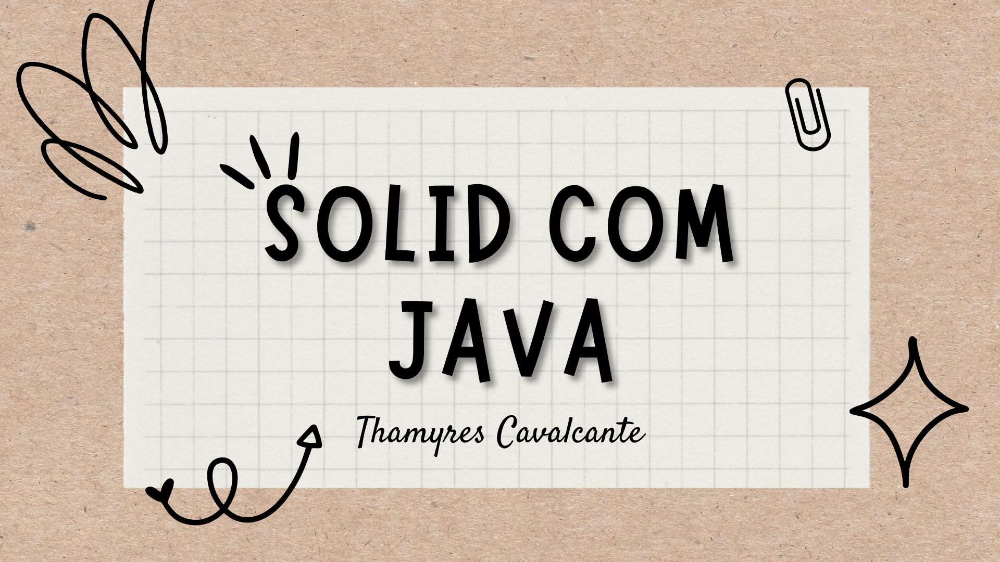

# Projeto para Estudo sobre SOLID

 

## 🚀 Tecnologias

Esse projeto foi desenvolvido com as seguintes tecnologias:
- Java
- Git e Github

 

## 💻 Projeto

Projeto desenvolvido em curso da Alura, para aprendizado sobre os principios do SOLID com Java.

 

## 📁 Acesso ao projeto

É possível baixar ou acessar o código fonte do projeto atraves desse [Link.](https://github.com/Thamyresmya/SOLID_Java.git)

 

Me siga nas redes sociais:
- [Linkedin](https://www.linkedin.com/in/thamyrescavalcante/)
- [Instagran](https://www.instagram.com/thamyres__cavalcante/)

 

---

Feito com ♥ by Thamyres Cavalcante.

